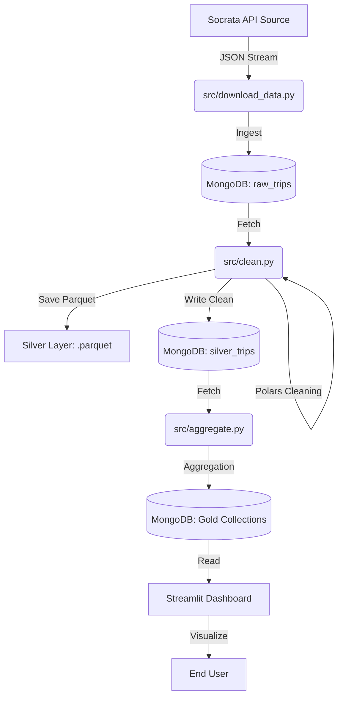

# Chicago Transit Analytics Pipeline 🚖

## Project Overview
This project implements an end-to-end Big Data pipeline for analyzing Chicago Taxi Trip data (post-2023). It utilizes a modern "Medallion Architecture" (Bronze/Silver/Gold) to ingest, clean, and aggregate over 600,000+ trip records. The final output is an interactive dashboard visualizing peak traffic times, payment methods, and popular community areas.

## Architecture & Tech Stack
* **Containerization:** Docker & Docker Compose (MongoDB, Mongo-Express)
* **Database:** MongoDB (NoSQL storage for Raw/Clean/Aggregated layers)
* **Data Processing:** Python + Polars (High-performance Apache Arrow dataframes)
* **Visualization:** Streamlit + Plotly
* **Orchestration:** Custom Python Pipeline
* **Cluster Configuration:** Single-node MongoDB instance (Docker). *Note: Designed to scale to a 3-node Replica Set (Primary-Secondary-Secondary) in production for high availability.*
### System Architecture Diagram

## Pipeline Layers
1.  **Bronze (Raw):** Ingests raw CSV data from the Chicago Data Portal API.
2.  **Silver (Clean):** Performs deduplication, schema validation, and null handling. Saves data as Parquet (Columnar storage).
3.  **Gold (Aggregated):** Aggregates business insights (Hourly trends, Top Areas) for the dashboard.

## Setup Instructions

### 1. Prerequisites
* Docker Desktop (Running)
* Python 3.10+
* uv (Python package manager)

### 2. Infrastructure Setup
Start the MongoDB database containers:
```bash
docker-compose up -d 
```

*Access Mongo Express UI at: http://localhost:8081*

### 3. Installation
Install project dependencies:
```bash
uv sync 
```

### How to Run
Option A: Run the Full Pipeline (Automated)
Execute the master pipeline script to download, ingest, clean, and aggregate data in one go:

```Bash

uv run src/pipeline.py
```
Option B: Run the Dashboard
Launch the interactive visualization app:

```Bash

uv run streamlit run src/app.py
```
### Key Files
src/download_data.py: Fetches latest dataset from Socrata API.

src/clean.py: Strict cleaning logic & Parquet generation.

src/aggregate.py: Generates Gold Layer metrics.

src/app.py: Streamlit dashboard code.