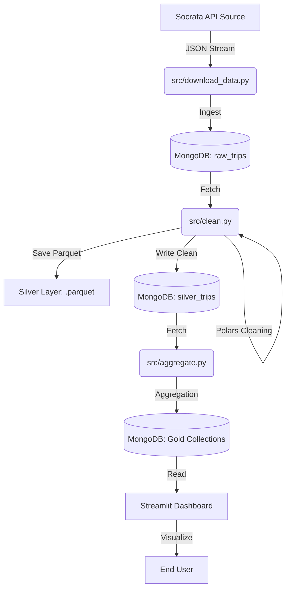
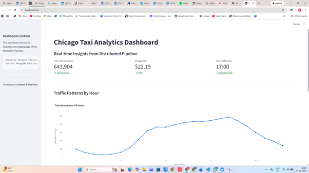
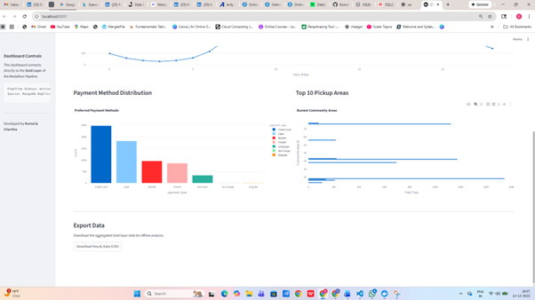

# Chicago Transit Analytics Pipeline 🚖

## Project Overview
This project implements an end-to-end Big Data pipeline for analyzing Chicago Taxi Trip data (post-2023). It uses a modern Medallion Architecture (Bronze/Silver/Gold) to ingest 750,000+ raw trip records (≈800,000 ingested) and produce ~644,000 high-quality cleaned records for aggregation. The final output is an interactive dashboard visualizing peak traffic times, payment methods, and popular community areas.

## Architecture & Tech Stack
* **Containerization:** Docker & Docker Compose (MongoDB, Mongo-Express)
* **Database:** MongoDB (NoSQL storage for Raw/Clean/Aggregated layers)
* **Data Processing:** Python + Polars (High-performance Apache Arrow dataframes)
* **Visualization:** Streamlit + Plotly
* **Orchestration:** Custom Python Pipeline
* **Cluster Configuration:** Single-node MongoDB instance (Docker). *Note: Designed to scale to a 3-node Replica Set (Primary-Secondary-Secondary) in production for high availability.*

### System Architecture Diagram


### Project Structure
```
├── data/
│   ├── processed/          # Silver layer output (Parquet files)
│   └── raw_data.csv        # Bronze layer input (CSV)
├── images/                 # Project screenshots for documentation
│   ├── dashboard1.png
│   └── dashboard2.png
├── src/
│   ├── __init__.py
│   ├── aggregate.py        # Gold Layer: Aggregates metrics for the dashboard
│   ├── app.py              # Streamlit Dashboard (Frontend)
│   ├── clean.py            # Silver Layer: Polars cleaning & Parquet generation
│   ├── download_data.py    # Fetches raw data from Socrata API
│   ├── ingest.py           # Bronze Layer: Ingests raw data into MongoDB
│   ├── models.py           # Pydantic models for data validation
│   └── pipeline.py         # Master orchestration script (Run this!)
├── tests/                  # Unit tests for data validation
│   └── test_validation.py
├── .gitignore              # Files to ignore in Git (secrets, venv, data)
├── docker-compose.yml      # MongoDB container configuration
├── pyproject.toml          # Project metadata & dependencies
├── README.md               # Project documentation
├── requirements.txt        # Python dependencies list
└── uv.lock                 # Lock file for dependencies
```
## Pipeline Layers
1.  **Bronze (Raw):** Ingests raw CSV data from the Chicago Data Portal API.
2.  **Silver (Clean):** Performs deduplication, schema validation, and null handling. Saves data as Parquet (Columnar storage).
3.  **Gold (Aggregated):** Aggregates business insights (Hourly trends, Top Areas) for the dashboard.

## Indexing & Performance
Indexes are created on frequently queried fields such as trip start time and pickup community area in the Silver and Gold MongoDB collections to improve aggregation and dashboard query performance.


## Setup Instructions

### 1. Prerequisites
* Docker Desktop (Running)
* Python 3.10+
* uv (Python package manager)

### 2. Infrastructure Setup
Start the MongoDB database containers:
```bash
docker-compose up -d 
```

*Access Mongo Express UI at: http://localhost:8081*

### 3. Installation
Install project dependencies:
```bash
uv sync 
```

### How to Run
Option A: Run the Full Pipeline (Automated)
Execute the master pipeline script to download, ingest, clean, and aggregate data in one go:

```Bash

uv run src/pipeline.py
```
Option B: Run the Dashboard
Launch the interactive visualization app:

```Bash

uv run streamlit run src/app.py
```

### Dashboard Screenshots
Here are views of the final dashboard visualizing the Gold Layer data:
### Executive Overview


### Detailed Metrics


### Key Files
- `src/download_data.py`: Fetches latest dataset from Socrata API
- `src/clean.py`: Strict cleaning logic & Parquet generation
- `src/aggregate.py`: Generates Gold Layer metrics
- `src/app.py`: Streamlit dashboard code
